## 🧭 Project Overview: Event Booking Platform

This repository contains a full-stack event booking system built with a modern web architecture for Areeb Web Development Competition:

- **Frontend**: React, Vite, TailwindCSS v4, TanStack Router, i18next
- **Backend**: Hono (Fast web framework), Drizzle ORM, Hexagonal Architecture + DDD principles
- **Infrastructure**: Docker Compose, PostgreSQL, Redis (optional), GitHub Actions, Vercel/Cloud hosting

---

## 🌍 Access the Platform

- **Frontend:** [https://areeb-frontend.vercel.app](https://areeb-frontend.vercel.app)
- **Backend API:** [https://areeb-backend.vercel.app](https://areeb-backend.vercel.app)

---

### 🖼️ System Architecture Diagram

> 

---

### 📁 Monorepo Structure

```
apps/
  frontend/     → Vite-based SPA frontend
  backend/      → Hono-based REST API backend
```

---

## ✅ CI/CD

- GitHub Actions build & deploy
- Vercel (frontend and backend)

### 🚀 Getting Started

#### Prerequisites

- Bun >= 1.2.0
- Docker + Docker Compose

#### 1. Clone the repo

```bash
git clone https://github.com/kofta999/ATC_01158254758.git
cd event-booking-platform
```

#### 2. Setup environment

```bash
cp .env.example .env
```

#### 3. Install dependencies

```bash
bun install
```

#### 4. Start dev servers

```bash
bun dev
```
