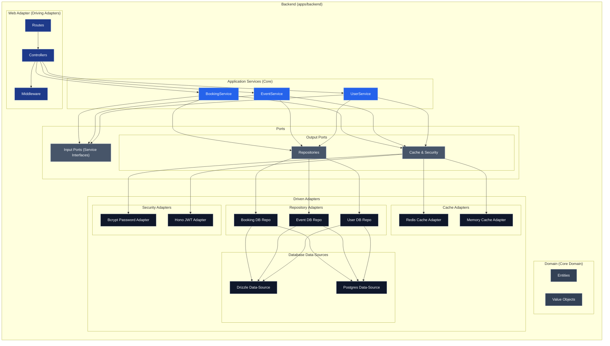

## 🔧 Backend (`apps/backend`)

### 🛠️ Tech Stack

- Hono.js (high-performance web framework)
- Drizzle ORM (for PostgreSQL)
- JWT Auth (via Hono JWT) + Bcrypt for password hashing
- Redis & in-memory caching support
- Layered architecture: Hexagonal + DDD practices

### ⚙️ Architecture



- **Driving Adapters**: Expose HTTP routes and middleware
- **Core Application Services**: Pure logic layer (BookingService, etc.)
- **Domain Layer**: Entities + ValueObjects as first-class citizens
- **Ports**:

  - Input Ports → Service interfaces
  - Output Ports → Repositories, Cache, Security

- **Driven Adapters**:

  - DB/Cache/Security implementations

### 📁 Structure

```
src/
  adapters/
    driving/web/         → HTTP routes, middleware, controllers
    driven/database/     → Drizzle/Postgres adapters
    driven/cache/        → Redis/Memory adapters
    driven/security/     → JWT/Bcrypt
  core/
    application/services/ → EventService, BookingService, etc.
    domain/entities/      → Domain models
    domain/value-objects/ → Strongly typed primitives
  ports/
    input/               → Service interfaces (Input Ports)
    output/              → Repos, Cache, Security (Output Ports)
```

### ✨ General Features

- Token-based authentication (JWT)
- RESTful CRUD API for events, users, bookings
- Service-level separation for testability and reuse
- Pluggable infra via adapters (e.g., swap cache layer)

### 🧪 Scripts

```bash
npm dev          # dev server
npm build        # build
npm lint         # lint code
npm test         # coming soon (unit + integration)
```

### 📡 API Routes

```txt
POST   /auth/login               → Login user
POST   /auth/register            → Register new user
GET    /events                   → Get all events (with optional filtering/pagination)
GET    /events/:id               → Get event details by ID
POST   /events                   → Create a new event (Admin only)
PUT    /events/:id               → Update an event by ID (Admin only)
DELETE /events/:id               → Delete an event by ID (Admin only)
POST   /bookings                 → Create a new booking (User only)
GET    /bookings                 → Get user's bookings (User only)
DELETE /bookings/:id             → Delete a booking by ID (User only)
```

---

## 🧠 Design Decisions

- Adopted **hexagonal architecture** for testability & future adapters
- Used **CSS variables** + `@theme` for dark mode
- TanStack Router enables modular route-driven file setup
- Full i18n-ready frontend
