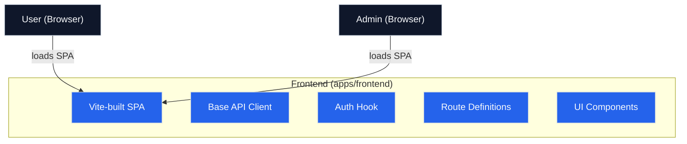

## 📦 Frontend (`apps/frontend`)

### 🛠️ Tech Stack

- React + Vite (SPA)
- TailwindCSS v4 with design system + dark mode via CSS variables
- TanStack Router (file-based routing)
- i18next for internationalization
- Strongly typed API client and hooks (`useAuth`, etc.)

### ⚙️ Architecture



- Modular component-based design
- Clear separation of views, reusable components, and logic
- Uses React context for auth state and language
- Global theming via Tailwind `@theme` block (no JS needed)

### 📁 Structure

```
src/
  components/         → UI components (Card, Button, etc.)
  routes/             → App routes (auth, dashboard, etc.)
  lib/
    base-api-client/  → Generated API client bindings
    hooks/            → `useAuth`, `useDarkMode`, etc.
```

### ✨ General Features

- User & admin login (JWT-based)
- Event browsing & booking
- Admin dashboard for event CRUD
- Responsive layout + dark mode
- Language switching with i18n

### 🧪 Scripts

```bash
bun dev       # start dev server
bun build     # production build
bun preview   # preview production build
```

### 🧭 Routes

```txt
/pages/
  /                             → Landing Page
  /login                        → User login
  /register                     → User register
  /events                       → List of all available events
  /events/:id                   → Event details & booking
  /booking-success              → Congratulations page for successful event booking
  /bookings                     → Authenticated user's bookings
  /admin/login                  → Admin login
  /admin/dashboard              → Admin event management
  /admin/dashboard/events/new   → Admin create event
  /admin/dashboard/events/:id   → Admin edit event
```
